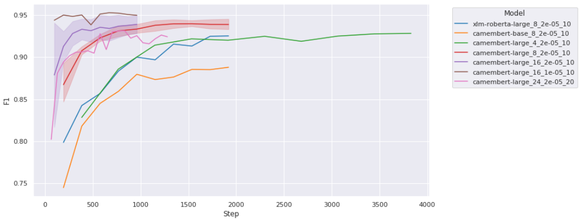

# [TETIS](https://www.umr-tetis.fr) @ [Challenge TextMine 2024](https://textmine.sciencesconf.org/resource/page/id/9)

---
Le Challenge 2024 de TextMine `Reconnaissance d'entités géographiques dans un corpus des instructions nautiques`, disponible sous [Kaggle](https://www.kaggle.com/competitions/defi-textmine-2024/overview) vise à détecter les mentions de lieux décrit dans les volumes de descriptions des litoraux constitué par l’Institut national de l'information géographique et forestière (IGN) et le Service hydrographique et océanographique de la Marine (Shom).

| Participants               |
|----------------------|
| Rémy Decoupes        |
| Roberto Interdonato  |
| Rodrique Kafando     |
| Mehtab Syed Alam     |
| Maguelonne Teisseire |
| Mathieu Roche        |
| Sarah Valentin       |

---
## Description du dépôt logiciel
Ce dépôt propose 4 notebooks :
1. [Pipeline spaCy](notebook/Pipeline%20Spacy.ipynb) : ce notebook permet de ré-entrainé un modèle issu de la librairie spaCy (fr_core_news_lg)
2. [Fine-tuning de modèle de type BERT](notebook/BERT-like%20models%20fine-tuning.ipynb) : ce notebook permet d'entraîner des modèles de langues de type BERT (comme RoBERTa, XLM-RoBERTa, Camembert, ...) sur le jeux de données du challenge
3. [Evaluer les entraînements](notebook/mlflow_results_formating.ipynb) : le précédent notebook permet d'enregistrer toutes les métriques des entraînements via l'outil [MLflow](https://mlflow.org/). Ce notebook, quant à lui, permet de mettre en forme ces résultats comme illustré par la Fig. 1 ci-dessous.
4. [Inferring](notebook/Inferring%20with%20BERT-like%20fine-tuned%20models-no-pipeline.ipynb) : il permet de prédire les labels des tokens pour cette tâche

<em>Figure 1: Comparaison de modèles pré-entraînés avec différents hyperparamètres.</em>

